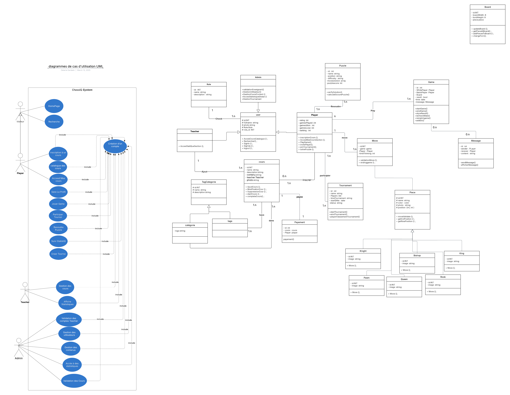

# CHESSIQ
Fill Rouge

## Class diagram et use case

  

---
## 📜 Introduction
 conception

[🔗 View conception](https://lucid.app/lucidchart/b67f3570-cd20-482a-ade2-333ae1f71410/edit?viewport_loc=-2401%2C-1889%2C6455%2C2681%2C0_0&invitationId=inv_d8dc5726-f865-44f2-8f9b-302384843481)

